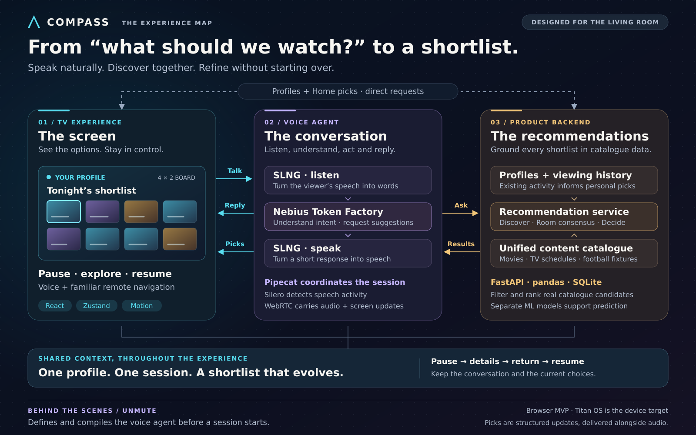

# Compass

## A conversation that helps the whole room choose

**From “what should we watch?” to a small, understandable shortlist.**

Compass brings voice-guided discovery to the living-room TV. Viewers describe
what they feel like watching, see the options take shape, and refine their
choices without starting the search again.

The experience connects three things: **a screen people can navigate,
a conversation that understands their intent, and a recommendation service
grounded in catalogue data.**

## The big picture

*Open the diagram at full size for presenting. The vector artwork stays sharp
when enlarged or imported into a slide deck.*

### How to walk through the diagram

Read the three panels from left to right, then follow the arrows back:

1. **The screen** gives the viewer a place to speak, see suggestions and explore.
2. **The conversation** turns spoken intent into a useful recommendation request.
3. **The recommendations** come from the product’s catalogue and viewing context.
4. **The return journey** brings back a spoken reply and a visible shortlist.
5. **The shared context** keeps the experience together as the viewer pauses,
   explores a title, returns and resumes.

The dashed connection at the top shows a second path: the screen can load
profiles and Home recommendations directly. Starting a conversation is not
required to browse those suggestions.

## Three components, three clear responsibilities

### 01 · The screen — confidence from the sofa

The TV experience makes a conversation visible. A selected profile establishes
whose viewing context is active. The voice control shows the conversation’s
state, while a board of up to eight recommendations keeps the choice manageable.

The viewer can use familiar remote controls to move between cards, open details
and choose a title. Pausing creates room to explore; resuming continues the
conversation with the current context.

**Why this matters:** voice makes it easier to express a request, while the
screen gives people time to compare the answers.

### 02 · The conversation — a guide that listens and acts

The voice agent brings together four roles:

| Role | What it contributes |
| --- | --- |
| **Listen** | SLNG turns the viewer’s speech into words. |
| **Understand** | Nebius Token Factory interprets the request and decides whether to ask a short clarification or request recommendations. |
| **Act** | The agent asks the recommendation service for candidates, refines an existing search, or retrieves details of a previously suggested title. |
| **Reply** | SLNG turns the agent’s brief response into speech. |

Pipecat coordinates these steps. WebRTC connects the conversation to the TV,
carrying audio and the separate messages that update the board. Silero detects
speech activity to help the conversation respond to the viewer’s turns.

**Why this matters:** the viewer can say “something shorter” and continue the
same search. The agent translates that request into an action the product can
perform.

### 03 · The recommendations — choices grounded in content

The backend brings together movies, scheduled TV programmes and football
fixtures. Existing viewing activity provides the profiles and their history,
so the product can use expressed preferences or viewing habits according to
the chosen mode.

It filters and ranks catalogue candidates, then returns the items and their
available details. The screen and the voice agent work from those returned
items. Titles on the board arrive as a dedicated recommendation update, separate
from the spoken reply.

**Why this matters:** the conversation can remain natural while the visible
choices stay tied to the product’s catalogue.

## One experience, three ways to begin

| Mode | The viewer’s starting point | What shapes the shortlist |
| --- | --- | --- |
| **Discover** | “A comedy, ideally under ninety minutes.” | The requested genre, duration, mood and content types. |
| **Room consensus** | “We’re watching together.” | Participants’ preferences, with shared constraints such as the tightest time budget. |
| **Decide for me** | “Help me pick.” | The active profile’s existing viewing history and chosen content types. |

Discover prioritizes matching items; the current prototype may fill remaining
spaces with broader catalogue choices when matches are limited. Decide for me
uses history rather than new mood or duration filters; Discover is the mode for
those requests.

Room participants can express preferences without creating a new profile.
Selecting a profile provides context; Compass does not identify individual
speakers from their voices.

## A viewer journey worth presenting

| Moment | What the viewer experiences | What the system keeps together |
| --- | --- | --- |
| **Choose a profile** | A familiar starting point and Home suggestions. | The active viewer’s context. |
| **Describe the evening** | “We’d like a comedy, around two hours.” | The selected mode and expressed preferences. |
| **See a shortlist** | Up to eight candidates appear on the board. | The returned titles, details and recommendation criteria. |
| **Change one thing** | “Actually, make it ninety minutes.” | The existing search, with the changed preference applied. |
| **Pause and explore** | Use the remote to open a title and return. | The current conversation, candidate details and selection. |
| **Resume** | Continue discussing the options. | The same session rather than a new search. |

Session memory gives this journey continuity. Both the conversation and the
screen retain the recommendation items they need for details. That memory is
temporary: reloading the browser or leaving the session clears the active search.

## Why these tools fit the experience

### Make the TV feel clear and responsive

| Tools | Their role | Why the choice fits Compass |
| --- | --- | --- |
| **React + TypeScript** | Organize the screens and the information they share. | Support a consistent experience as profiles, conversation state and recommendations change. |
| **Zustand** | Keep the active profile, voice state and current choices together. | Preserve continuity when moving between the board and a title’s details. |
| **Motion + OGL** | Animate changing recommendations and create ambient visual backgrounds. | Help viewers follow changes and recognize the conversation’s state, while respecting reduced-motion preferences. |
| **Vite** | Support development and prepare the browser experience for delivery. | Shorten the feedback loop when refining a visual, interaction-heavy product. |

### Make conversation a coordinated experience

| Tools | Their role | Why the choice fits Compass |
| --- | --- | --- |
| **SLNG** | Provide both speech recognition and spoken responses. | Cover both ends of the voice interaction through one speech platform. |
| **Nebius Token Factory** | Host the conversational reasoning model. | Turn everyday language into useful clarifications, recommendation requests and concise replies. |
| **Pipecat** | Coordinate the running voice pipeline and its actions. | Bring listening, reasoning, speaking and screen updates into one conversation. |
| **WebRTC / SmallWebRTC** | Carry live audio and agent messages between the TV and voice service. | Let the conversation and recommendation updates share one connection. |
| **Silero** | Detect speech activity locally in the voice service. | Help determine when the viewer is speaking without adding a separate hosted speech-detection service. |
| **Unmute** | Define the agent and compile it into the voice runtime. | Keep provider choices and conversational behavior in one agent definition that can be validated before running. |

Unmute belongs **before the live conversation**: it prepares the agent.
Pipecat belongs **during the conversation**: it runs the coordinated experience.
The current provider choices are Deepgram Nova 3 and Aura 2 through SLNG, and
Qwen3 through Nebius Token Factory.

### Give recommendations a dependable foundation

| Tools | Their role | Why the choice fits Compass |
| --- | --- | --- |
| **FastAPI** | Provide the shared backend service. | Let the TV experience and voice agent request recommendations from the same product logic. |
| **pandas** | Bring different catalogue sources into a common form and filter candidates. | Make movies, TV schedules and football fixtures usable in one recommendation experience. |
| **SQLite** | Store profiles’ viewing activity. | Provide a lightweight foundation for a local prototype and history-based suggestions. |
| **scikit-learn** | Support separate genre and movie prediction models. | Allow experiments with history and context-based predictions alongside the catalogue recommendation service. |

The current shortlist uses catalogue filtering, ranking and history-based genre
weights. The separately trained prediction models are another backend capability;
they are not required to produce the shortlist shown in the diagram.

## Design decisions the audience should remember

**Conversation and content have distinct responsibilities.** The agent interprets
the request; the recommendation service supplies the candidate titles. The board
receives those results directly as structured updates.

**The viewer stays in control.** Speech, remote navigation, pause and resume
belong to the same experience. Animation explains a change, and reduced-motion
support lets the presentation remain calm.

**Continuity is part of the product.** Opening a detail does not mean abandoning
the conversation. The selected profile, current choices and session context keep
the journey coherent.

**Each layer can evolve.** The TV presentation, conversation providers and
recommendation strategy have separate responsibilities. A platform boundary
keeps the current browser experience separate from future Titan OS integration.
Provider credentials stay in the voice service.

## A 60-second presentation script

> “Compass helps people decide what to watch through a short conversation.
>
> Start on the left: the viewer chooses a profile and speaks to the TV. The
> interface gives them a small board of choices and familiar remote controls.
>
> In the middle, SLNG handles speech and Nebius understands the request. Pipecat
> coordinates the conversation, while WebRTC connects it to the screen.
>
> On the right, our recommendation service brings together movies, TV schedules,
> football fixtures and viewing context. It returns catalogue candidates, and
> the agent sends the shortlist back to the screen alongside its spoken reply.
>
> The viewer can then ask for something shorter, pause to inspect a title, and
> resume. The profile, the conversation and the current choices stay together.
>
> That is the idea behind Compass: talk about what fits tonight, then explore
> a manageable set of options.”

## Presentation scope

This map describes the integrated browser MVP. Titan OS is the device target;
hardware validation remains ahead. Catalogue and history come from the
prototype’s supplied datasets, rather than live streaming-provider availability.
Choosing a title records a selection; playback and provider handoff remain
future work.

A live voice demo also needs SLNG and Nebius configured and validated locally.
